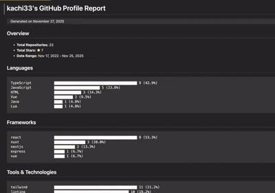

# RepoLens

A GitHub repository analyzer that generates beautifully dramatic reports about your public code.

Ever wanted a tool that goes through your GitHub profile and tells you what you're actually building instead of what you think you're building?
Yeah - that's RepoLens.

It scans your repositories, detects your tech stacks, and produces a gorgeous markdown report that looks like something you'd proudly attach to your CV.

## Features

- Analyzes all repositories in your GitHub profile
- Detects frameworks, libraries, and tools used across your repos
- Provides clean insights on:
  - Programming languages
  - Frameworks (React, Vue, Express, Django, etc.)
  - Tools (Vite, Webpack, Tailwind, Prisma, etc.)
  - Repo metadata like stars and creation/update dates
- Extensible tagging engine so you can add custom tech detection
- Generates a very, very pretty markdown report
  (Yes, prettier than the code you wrote at 2AM.)

## Getting Started

```bash
git clone https://github.com/yourusername/repolens.git
cd repolens
npm install
```

Then create a `.env` file:

```bash
GITHUB_TOKEN=your_github_personal_access_token
```

That's it. You're officially a RepoLens operator.

## Getting Your GitHub Token

1. Go to GitHub - Settings - Developer settings - Personal access tokens
2. Create a new classic token with `public_repo` or `repo` scope
3. Copy it like it's a password to your secret lair
4. Paste it into `.env`

## Usage

**Basic**
```bash
npm run dev -- -u <github-username>
```

**Custom Output Path**
```bash
npm run dev -- -u <github-username> -o <output-file>
```

**Build & Run**
```bash
npm run build
npm start -- -u <github-username>
```

## Command Line Options

- `-u, --user <user>` - GitHub username (required)
- `-t, --token <token>` - GitHub token (optional if in .env)
- `-o, --output <file>` - Output file path (default: `./repolens_report.md`)

## Output

You'll get a nicely structured markdown report that visually summarises your repos and technologies.
Perfect for:

- Portfolios
- Hiring managers
- Impressing your friends
- Quietly judging your own tech stack choices



## Technology Detection

RepoLens automatically detects:

**Frameworks**
React, Vue, Angular, Svelte, Next.js, Nuxt, Express, NestJS, Django, Flask, FastAPI, React Native, Electron, Tauri, and more.

**Tools**
Vite, Webpack, Rollup, Jest, Cypress, Tailwind, Prisma, Sequelize, Docker, GitHub Actions, and others.

## Extending the Tagging Engine

If you use something "niche" (or invented), you can add it:

```typescript
tagger.addTagMapping({
    tag: 'my-framework',
    type: 'framework',
    patterns: ['my-framework', '@my-framework/core']
});
```

Go wild.

## Requirements

- Node.js 14+
- A GitHub Personal Access Token
- A desire to see your GitHub profile look cooler than ever

## License

ISC

Made with love by KACHI
(And zero judgment about your old repositories.)
